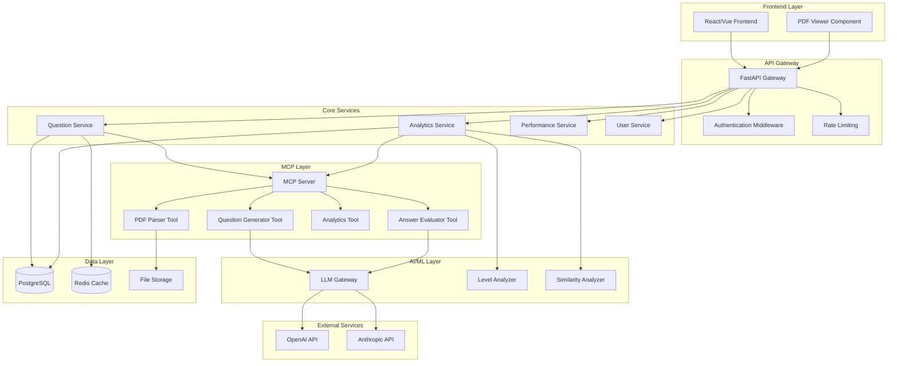

# Design Document - Adaptive Question System

## Overview

Bu sistem, öğrencilerin geçmiş hatalarını analiz ederek kişiselleştirilmiş eğitim deneyimi sunan akıllı bir platformdur. Sistem, matematik alanında hazır soru havuzundan seviyeye uygun öneriler yaparken, İngilizce alanında öğrencinin hatalarına odaklanan dinamik sorular üretir. PDF entegrasyonu ile mevcut soru arşivlerinin kullanımını destekler.

## Architecture

### High-Level Architecture



### System Components

#### 1. API Layer
- **FastAPI Gateway**: Ana API endpoint'leri
- **Authentication**: JWT tabanlı kimlik doğrulama
- **Rate Limiting**: API kullanım sınırları
- **CORS**: Cross-origin resource sharing

#### 2. Core Services
- **Question Service**: Soru öneri ve üretim mantığı
- **Analytics Service**: Hata analizi ve seviye belirleme
- **Performance Service**: Öğrenci performans takibi
- **User Service**: Kullanıcı yönetimi
- **Security Service**: PDF güvenlik kontrolü ve veri şifreleme
- **Quality Control Service**: Soru kalite kontrol ve doğrulama
- **Spaced Repetition Service**: Aralıklı tekrar planlama

#### 3. MCP Integration Layer
- **MCP Server**: Model Context Protocol server
- **Question Generator Tool**: İngilizce soru üretimi MCP tool
- **Answer Evaluator Tool**: Cevap değerlendirme MCP tool
- **Analytics Tool**: Performans analizi MCP tool
- **PDF Parser Tool**: PDF işleme MCP tool

#### 4. AI/ML Components
- **LLM Gateway**: Çoklu LLM provider yönetimi
- **Level Analyzer**: Dinamik seviye belirleme
- **Similarity Analyzer**: Benzer öğrenci bulma

## Components and Interfaces

### 1. Database Schema

```sql
-- Users table
CREATE TABLE users (
    id UUID PRIMARY KEY DEFAULT gen_random_uuid(),
    username VARCHAR(50) UNIQUE NOT NULL,
    email VARCHAR(100) UNIQUE NOT NULL,
    role VARCHAR(20) DEFAULT 'student',
    current_math_level INTEGER DEFAULT 1,
    current_english_level INTEGER DEFAULT 1,
    learning_style VARCHAR(20) DEFAULT 'mixed', -- visual, auditory, kinesthetic, mixed
    created_at TIMESTAMP DEFAULT NOW(),
    updated_at TIMESTAMP DEFAULT NOW()
);

-- Questions table
CREATE TABLE questions (
    id UUID PRIMARY KEY DEFAULT gen_random_uuid(),
    subject VARCHAR(20) NOT NULL, -- 'math' or 'english'
    content TEXT NOT NULL,
    question_type VARCHAR(50) NOT NULL,
    difficulty_level INTEGER NOT NULL,
    original_difficulty INTEGER NOT NULL, -- Orijinal zorluk seviyesi
    topic_category VARCHAR(100) NOT NULL,
    correct_answer TEXT,
    options JSONB, -- Çoktan seçmeli için seçenekler
    source_type VARCHAR(20) DEFAULT 'manual', -- 'pdf', 'generated', 'manual'
    pdf_source_path VARCHAR(500),
    metadata JSONB,
    created_at TIMESTAMP DEFAULT NOW()
);

-- Student attempts table
CREATE TABLE student_attempts (
    id UUID PRIMARY KEY DEFAULT gen_random_uuid(),
    user_id UUID REFERENCES users(id),
    question_id UUID REFERENCES questions(id),
    student_answer TEXT,
    is_correct BOOLEAN NOT NULL,
    time_spent INTEGER, -- saniye cinsinden
    attempt_date TIMESTAMP DEFAULT NOW(),
    error_category VARCHAR(100),
    grammar_errors JSONB, -- İngilizce için grammar hataları
    vocabulary_errors JSONB -- İngilizce için vocabulary hataları
);

-- Error patterns table
CREATE TABLE error_patterns (
    id UUID PRIMARY KEY DEFAULT gen_random_uuid(),
    user_id UUID REFERENCES users(id),
    subject VARCHAR(20) NOT NULL,
    error_type VARCHAR(100) NOT NULL,
    error_count INTEGER DEFAULT 1,
    last_occurrence TIMESTAMP DEFAULT NOW(),
    topic_category VARCHAR(100),
    difficulty_level INTEGER
);

-- Question difficulty adjustments table
CREATE TABLE question_difficulty_adjustments (
    id UUID PRIMARY KEY DEFAULT gen_random_uuid(),
    question_id UUID REFERENCES questions(id),
    user_id UUID REFERENCES users(id),
    old_difficulty INTEGER NOT NULL,
    new_difficulty INTEGER NOT NULL,
    adjustment_reason TEXT,
    created_at TIMESTAMP DEFAULT NOW()
);

-- Spaced repetition table
CREATE TABLE spaced_repetition (
    user_id UUID REFERENCES users(id),
    question_id UUID REFERENCES questions(id),
    next_review_at TIMESTAMP NOT NULL,
    ease_factor FLOAT DEFAULT 2.5,
    review_count INTEGER DEFAULT 0,
    last_reviewed TIMESTAMP DEFAULT NOW(),
    PRIMARY KEY (user_id, question_id)
);

-- Math error details table
CREATE TABLE math_error_details (
    id UUID PRIMARY KEY DEFAULT gen_random_uuid(),
    attempt_id UUID REFERENCES student_attempts(id),
    operation VARCHAR(50), -- addition, subtraction, multiplication, division
    math_concept VARCHAR(100), -- fractions, equations, geometry, etc.
    error_step SMALLINT, -- Hatanın yapıldığı çözüm adımı
    created_at TIMESTAMP DEFAULT NOW()
);

-- PDF uploads table
CREATE TABLE pdf_uploads (
    id UUID PRIMARY KEY DEFAULT gen_random_uuid(),
    filename VARCHAR(255) NOT NULL,
    file_path VARCHAR(500) NOT NULL,
    uploaded_by UUID REFERENCES users(id),
    subject VARCHAR(20) NOT NULL,
    questions_extracted INTEGER DEFAULT 0,
    processing_status VARCHAR(20) DEFAULT 'pending',
    quality_score FLOAT, -- PDF kalite puanı
    virus_scan_status VARCHAR(20) DEFAULT 'pending',
    created_at TIMESTAMP DEFAULT NOW()
);
```

### 2. Core Service Interfaces

#### Question Service Interface
```python
from abc import ABC, abstractmethod
from typing import List, Optional
from pydantic import BaseModel

class QuestionRequest(BaseModel):
    user_id: str
    subject: str  # 'math' or 'english'
    count: int = 1

class QuestionResponse(BaseModel):
    id: str
    content: str
    question_type: str
    difficulty_level: int
    options: Optional[List[str]]
    source_type: str

class IQuestionService(ABC):
    @abstractmethod
    async def get_recommended_questions(self, request: QuestionRequest) -> List[QuestionResponse]:
        """Öğrenci için önerilen soruları getirir"""
        pass
    
    @abstractmethod
    async def generate_english_question(self, user_id: str, error_patterns: List[str]) -> QuestionResponse:
        """İngilizce soru üretir"""
        pass
    
    @abstractmethod
    async def submit_answer(self, user_id: str, question_id: str, answer: str) -> bool:
        """Cevap gönderir ve değerlendirir"""
        pass
```

#### Analytics Service Interface
```python
class PerformanceMetrics(BaseModel):
    accuracy_rate: float
    average_time: float
    improvement_trend: str
    weak_areas: List[str]

class IAnalyticsService(ABC):
    @abstractmethod
    async def analyze_student_performance(self, user_id: str, subject: str) -> PerformanceMetrics:
        """Öğrenci performansını analiz eder"""
        pass
    
    @abstractmethod
    async def update_difficulty_level(self, user_id: str, question_id: str, performance: float):
        """Soru zorluk seviyesini günceller"""
        pass
    
    @abstractmethod
    async def find_similar_students(self, user_id: str) -> List[str]:
        """Benzer hata profiline sahip öğrencileri bulur"""
        pass
```

### 3. MCP Tools Architecture

```python
# MCP Tool Definitions
from mcp import Tool, types
from typing import List, Dict, Any

class QuestionGeneratorTool(Tool):
    name = "generate_english_question"
    description = "İngilizce soru üretir, öğrencinin hata geçmişine göre"
    
    input_schema = {
        "type": "object",
        "properties": {
            "user_id": {"type": "string"},
            "error_patterns": {
                "type": "array",
                "items": {"type": "string"}
            },
            "difficulty_level": {"type": "integer", "minimum": 1, "maximum": 5},
            "question_type": {
                "type": "string", 
                "enum": ["multiple_choice", "fill_blank", "open_ended"]
            },
            "focus_areas": {
                "type": "array",
                "items": {"type": "string"}
            }
        },
        "required": ["user_id", "error_patterns", "difficulty_level"]
    }
    
    async def call(self, arguments: Dict[str, Any]) -> types.CallToolResult:
        # Soru üretimi mantığı
        question_data = await self._generate_question(arguments)
        return types.CallToolResult(content=[
            types.TextContent(type="text", text=json.dumps(question_data))
        ])

class AnswerEvaluatorTool(Tool):
    name = "evaluate_answer"
    description = "Öğrenci cevabını değerlendirir ve hata analizi yapar"
    
    input_schema = {
        "type": "object",
        "properties": {
            "question_content": {"type": "string"},
            "correct_answer": {"type": "string"},
            "student_answer": {"type": "string"},
            "subject": {"type": "string", "enum": ["math", "english"]},
            "question_type": {"type": "string"}
        },
        "required": ["question_content", "correct_answer", "student_answer", "subject"]
    }
    
    async def call(self, arguments: Dict[str, Any]) -> types.CallToolResult:
        evaluation = await self._evaluate_answer(arguments)
        return types.CallToolResult(content=[
            types.TextContent(type="text", text=json.dumps(evaluation))
        ])

class AnalyticsTool(Tool):
    name = "analyze_performance"
    description = "Öğrenci performansını analiz eder ve seviye önerir"
    
    input_schema = {
        "type": "object",
        "properties": {
            "user_id": {"type": "string"},
            "subject": {"type": "string", "enum": ["math", "english"]},
            "recent_attempts": {
                "type": "array",
                "items": {
                    "type": "object",
                    "properties": {
                        "is_correct": {"type": "boolean"},
                        "time_spent": {"type": "integer"},
                        "difficulty_level": {"type": "integer"}
                    }
                }
            }
        },
        "required": ["user_id", "subject", "recent_attempts"]
    }

class PDFParserTool(Tool):
    name = "parse_pdf_questions"
    description = "PDF'den soruları çıkarır, kategorize eder ve öğrenciye gönderilecek formata dönüştürür"
    
    input_schema = {
        "type": "object",
        "properties": {
            "pdf_path": {"type": "string"},
            "subject": {"type": "string", "enum": ["math", "english"]},
            "expected_difficulty": {"type": "integer", "minimum": 1, "maximum": 5},
            "extract_images": {"type": "boolean", "default": True},
            "preserve_formatting": {"type": "boolean", "default": True}
        },
        "required": ["pdf_path", "subject"]
    }
    
    async def call(self, arguments: Dict[str, Any]) -> types.CallToolResult:
        # PDF'i parse et ve soruları çıkar
        questions = await self._extract_questions_from_pdf(arguments)
        return types.CallToolResult(content=[
            types.TextContent(type="text", text=json.dumps(questions))
        ])

class PDFContentReaderTool(Tool):
    name = "read_pdf_content"
    description = "PDF içeriğini okur ve metin/görsel olarak ayrıştırır"
    
    input_schema = {
        "type": "object",
        "properties": {
            "pdf_path": {"type": "string"},
            "page_range": {
                "type": "object",
                "properties": {
                    "start": {"type": "integer", "minimum": 1},
                    "end": {"type": "integer", "minimum": 1}
                }
            },
            "extract_mode": {
                "type": "string", 
                "enum": ["text_only", "images_only", "both"],
                "default": "both"
            }
        },
        "required": ["pdf_path"]
    }

class QuestionDeliveryTool(Tool):
    name = "deliver_question_to_student"
    description = "Soruyu öğrenciye uygun formatta hazırlar ve API üzerinden gönderir"
    
    input_schema = {
        "type": "object",
        "properties": {
            "question_data": {
                "type": "object",
                "properties": {
                    "content": {"type": "string"},
                    "images": {"type": "array", "items": {"type": "string"}},
                    "question_type": {"type": "string"},
                    "options": {"type": "array", "items": {"type": "string"}}
                }
            },
            "user_id": {"type": "string"},
            "learning_style": {"type": "string", "enum": ["visual", "auditory", "kinesthetic", "mixed"]},
            "delivery_format": {"type": "string", "enum": ["web", "mobile", "pdf_viewer"]}
        },
        "required": ["question_data", "user_id"]
    }
```

### 4. PDF Processing MCP Workflow

```python
class PDFProcessingWorkflow:
    """PDF'den öğrenciye soru gönderme tam workflow'u"""
    
    def __init__(self, mcp_client: Client):
        self.mcp = mcp_client
    
    async def process_and_deliver_pdf_question(
        self, 
        pdf_path: str, 
        user_id: str, 
        subject: str
    ) -> Dict[str, Any]:
        """PDF'den soru çıkarıp öğrenciye gönderme"""
        
        # 1. PDF içeriğini oku
        pdf_content = await self.mcp.call_tool(
            "read_pdf_content",
            {
                "pdf_path": pdf_path,
                "extract_mode": "both"
            }
        )
        
        # 2. Soruları parse et
        parsed_questions = await self.mcp.call_tool(
            "parse_pdf_questions",
            {
                "pdf_path": pdf_path,
                "subject": subject,
                "extract_images": True,
                "preserve_formatting": True
            }
        )
        
        # 3. Öğrenci profilini al
        user_profile = await self.get_user_profile(user_id)
        
        # 4. Her soru için öğrenciye uygun format hazırla
        questions_data = json.loads(parsed_questions.content[0].text)
        
        delivered_questions = []
        for question in questions_data:
            # Öğrenme stiline göre adapte et
            adapted_question = await self.adapt_for_learning_style(
                question, 
                user_profile.learning_style
            )
            
            # API üzerinden gönder
            delivery_result = await self.mcp.call_tool(
                "deliver_question_to_student",
                {
                    "question_data": adapted_question,
                    "user_id": user_id,
                    "learning_style": user_profile.learning_style,
                    "delivery_format": "web"
                }
            )
            
            delivered_questions.append(delivery_result)
        
        return {
            "total_questions": len(questions_data),
            "delivered_questions": delivered_questions,
            "processing_status": "completed"
        }
    
    async def adapt_for_learning_style(self, question: dict, learning_style: str) -> dict:
        """Öğrenme stiline göre soru adaptasyonu"""
        
        if learning_style == "visual":
            # Görsel öğrenciler için
            question["include_diagrams"] = True
            question["highlight_keywords"] = True
            question["use_colors"] = True
            
        elif learning_style == "auditory":
            # İşitsel öğrenciler için
            question["include_audio"] = True
            question["text_to_speech"] = True
            
        elif learning_style == "kinesthetic":
            # Kinestetik öğrenciler için
            question["interactive_elements"] = True
            question["step_by_step"] = True
        
        return question

class PDFQuestionExtractor:
    """MCP tools kullanarak PDF soru çıkarma"""
    
    async def extract_with_mcp(self, pdf_path: str, subject: str) -> List[Dict]:
        """MCP tools ile PDF'den soru çıkarma"""
        
        # 1. PDF güvenlik kontrolü
        security_check = await self.security_service.validate_pdf_upload(pdf_path)
        if security_check.virus_scan_result != "clean":
            raise SecurityError("PDF güvenlik kontrolünden geçemedi")
        
        # 2. MCP ile içerik okuma
        content_result = await self.mcp.call_tool(
            "read_pdf_content",
            {
                "pdf_path": pdf_path,
                "extract_mode": "both"
            }
        )
        
        # 3. MCP ile soru parsing
        questions_result = await self.mcp.call_tool(
            "parse_pdf_questions",
            {
                "pdf_path": pdf_path,
                "subject": subject,
                "expected_difficulty": 3  # Orta seviye varsayılan
            }
        )
        
        # 4. Kalite kontrol
        questions = json.loads(questions_result.content[0].text)
        validated_questions = []
        
        for question in questions:
            quality_metrics = await self.quality_controller.evaluate_question_quality(
                question["content"], 
                subject
            )
            
            if await self.quality_controller.auto_approve_question(quality_metrics):
                question["quality_score"] = quality_metrics.overall_quality
                validated_questions.append(question)
        
        return validated_questions
```

### 5. MCP Server Configuration

```python
# mcp_server.py
from mcp.server import Server
from mcp.server.stdio import stdio_server
from app.mcp.tools import (
    QuestionGeneratorTool, 
    AnswerEvaluatorTool, 
    AnalyticsTool, 
    PDFParserTool
)

app = Server("adaptive-question-system")

# Tools'ları kaydet
app.add_tool(QuestionGeneratorTool())
app.add_tool(AnswerEvaluatorTool())
app.add_tool(AnalyticsTool())
app.add_tool(PDFParserTool())

# Resources (soru şablonları, PDF templates, hata kategorileri vb.)
@app.list_resources()
async def list_resources():
    return [
        types.Resource(
            uri="question-templates://english/grammar",
            name="English Grammar Question Templates",
            mimeType="application/json"
        ),
        types.Resource(
            uri="error-patterns://math/common",
            name="Common Math Error Patterns",
            mimeType="application/json"
        ),
        types.Resource(
            uri="pdf-templates://question-formats",
            name="PDF Question Format Templates",
            mimeType="application/json"
        ),
        types.Resource(
            uri="learning-styles://adaptations",
            name="Learning Style Adaptation Rules",
            mimeType="application/json"
        ),
        types.Resource(
            uri="delivery-formats://student-interface",
            name="Student Interface Delivery Formats",
            mimeType="application/json"
        )
    ]

@app.read_resource()
async def read_resource(uri: str):
    if uri == "question-templates://english/grammar":
        templates = await load_grammar_templates()
        return types.ReadResourceResult(
            contents=[types.TextResourceContents(
                uri=uri,
                mimeType="application/json",
                text=json.dumps(templates)
            )]
        )

if __name__ == "__main__":
    stdio_server(app)
```

### 5. LLM/ML/RAG Strategy Implementation

#### LLM Provider Strategy

```python
from enum import Enum
from typing import Dict, Any, Optional

class LLMProvider(str, Enum):
    OPENAI_GPT4 = "openai_gpt4"
    OPENAI_GPT35 = "openai_gpt35"
    ANTHROPIC_CLAUDE_OPUS = "anthropic_claude_opus"
    ANTHROPIC_CLAUDE_SONNET = "anthropic_claude_sonnet"
    ANTHROPIC_CLAUDE_HAIKU = "anthropic_claude_haiku"
    LOCAL_MODEL = "local_model"

class LLMConfig(BaseModel):
    provider: LLMProvider
    model_name: str
    api_key: Optional[str]
    max_tokens: int
    temperature: float
    cost_per_1k_tokens: float
    supports_turkish: bool
    use_cases: List[str]  # ["question_generation", "answer_evaluation", "quality_control"]

class LLMRouter:
    """Görev tipine göre en uygun LLM'i seçer"""
    
    def __init__(self):
        self.providers = {
            # Birincil modeller - kritik görevler için
            "question_generation": LLMConfig(
                provider=LLMProvider.OPENAI_GPT4,
                model_name="gpt-4o",
                max_tokens=1000,
                temperature=0.7,
                cost_per_1k_tokens=0.03,
                supports_turkish=True,
                use_cases=["question_generation", "complex_evaluation"]
            ),
            
            # İkincil modeller - maliyet-etkin görevler için
            "answer_evaluation": LLMConfig(
                provider=LLMProvider.ANTHROPIC_CLAUDE_HAIKU,
                model_name="claude-3-haiku-20240307",
                max_tokens=500,
                temperature=0.3,
                cost_per_1k_tokens=0.0025,
                supports_turkish=True,
                use_cases=["answer_evaluation", "quick_feedback"]
            ),
            
            # Yerel model - tekrarlayan görevler için
            "pdf_processing": LLMConfig(
                provider=LLMProvider.LOCAL_MODEL,
                model_name="llama-3-8b-instruct",
                max_tokens=800,
                temperature=0.1,
                cost_per_1k_tokens=0.0,
                supports_turkish=False,
                use_cases=["pdf_parsing", "content_extraction"]
            )
        }
    
    async def get_provider_for_task(self, task_type: str, complexity: str = "medium") -> LLMConfig:
        """Görev tipine göre en uygun provider'ı seç"""
        
        if task_type == "english_question_generation":
            return self.providers["question_generation"]
        elif task_type == "answer_evaluation" and complexity == "simple":
            return self.providers["answer_evaluation"]
        elif task_type == "pdf_processing":
            return self.providers["pdf_processing"]
        else:
            return self.providers["question_generation"]  # Default
```

#### RAG System Architecture

```python
class RAGConfig(BaseModel):
    embedding_model: str
    vector_database: str
    similarity_threshold: float
    max_results: int
    rerank_enabled: bool

class EmbeddingStrategy:
    """Embedding model seçim stratejisi"""
    
    def __init__(self):
        self.models = {
            # Genel amaçlı - başlangıç için
            "general": {
                "model": "text-embedding-3-large",
                "provider": "openai",
                "dimensions": 3072,
                "cost_per_1k_tokens": 0.00013,
                "languages": ["en", "tr"],
                "use_case": "general_purpose"
            },
            
            # Türkçe özelleştirilmiş - gelecek için
            "turkish_optimized": {
                "model": "sentence-transformers/paraphrase-multilingual-mpnet-base-v2",
                "provider": "huggingface",
                "dimensions": 768,
                "cost_per_1k_tokens": 0.0,
                "languages": ["tr", "en"],
                "use_case": "turkish_semantic_search"
            }
        }
    
    def get_embedding_config(self, language: str = "tr") -> dict:
        """Dil ve kullanım durumuna göre embedding model seç"""
        if language == "tr":
            return self.models["general"]  # Başlangıçta genel model
        return self.models["general"]

class VectorSearchService:
    """pgvector ile vector search implementasyonu"""
    
    def __init__(self, db_connection, embedding_service):
        self.db = db_connection
        self.embedding_service = embedding_service
    
    async def create_vector_index(self):
        """Vector index'leri oluştur"""
        await self.db.execute("""
            -- Error patterns için vector extension
            CREATE EXTENSION IF NOT EXISTS vector;
            
            -- Error patterns tablosuna embedding kolonu ekle
            ALTER TABLE error_patterns 
            ADD COLUMN IF NOT EXISTS embedding vector(3072);
            
            -- Vector similarity index
            CREATE INDEX IF NOT EXISTS error_patterns_embedding_idx 
            ON error_patterns USING ivfflat (embedding vector_cosine_ops);
            
            -- Questions tablosu için embedding
            ALTER TABLE questions 
            ADD COLUMN IF NOT EXISTS content_embedding vector(3072);
            
            CREATE INDEX IF NOT EXISTS questions_embedding_idx 
            ON questions USING ivfflat (content_embedding vector_cosine_ops);
        """)
    
    async def find_similar_error_patterns(self, user_error: str, limit: int = 5) -> List[Dict]:
        """Benzer hata pattern'larını bul"""
        
        # User error'ı embedding'e çevir
        error_embedding = await self.embedding_service.get_embedding(user_error)
        
        # Vector similarity search
        query = """
        SELECT ep.*, 1 - (ep.embedding <=> $1::vector) as similarity
        FROM error_patterns ep
        WHERE 1 - (ep.embedding <=> $1::vector) > 0.7
        ORDER BY ep.embedding <=> $1::vector
        LIMIT $2
        """
        
        results = await self.db.fetch_all(query, error_embedding, limit)
        return [dict(row) for row in results]
    
    async def find_similar_students(self, user_id: str) -> List[str]:
        """Benzer hata profiline sahip öğrencileri bul"""
        
        # Kullanıcının hata pattern'larını al
        user_patterns = await self.get_user_error_patterns(user_id)
        
        # Her pattern için benzer öğrencileri bul
        similar_students = set()
        for pattern in user_patterns:
            pattern_embedding = await self.embedding_service.get_embedding(pattern["error_type"])
            
            query = """
            SELECT DISTINCT ep.user_id, 
                   COUNT(*) as common_patterns,
                   AVG(1 - (ep.embedding <=> $1::vector)) as avg_similarity
            FROM error_patterns ep
            WHERE ep.user_id != $2
            AND 1 - (ep.embedding <=> $1::vector) > 0.6
            GROUP BY ep.user_id
            HAVING COUNT(*) >= 2
            ORDER BY avg_similarity DESC, common_patterns DESC
            LIMIT 10
            """
            
            results = await self.db.fetch_all(query, pattern_embedding, user_id)
            similar_students.update([row["user_id"] for row in results])
        
        return list(similar_students)
```

#### ML Pipeline Implementation

```python
from sklearn.ensemble import RandomForestClassifier
from sklearn.cluster import KMeans, DBSCAN
import numpy as np

class ErrorPatternClassifier:
    """Hata pattern'larını sınıflandırma ML modeli"""
    
    def __init__(self):
        self.math_classifier = RandomForestClassifier(n_estimators=100, random_state=42)
        self.english_classifier = RandomForestClassifier(n_estimators=100, random_state=42)
        self.is_trained = False
    
    async def train_models(self):
        """Mevcut verilerle modelleri eğit"""
        
        # Matematik hataları için training data
        math_data = await self.prepare_math_training_data()
        if len(math_data) > 100:  # Minimum data requirement
            X_math, y_math = math_data["features"], math_data["labels"]
            self.math_classifier.fit(X_math, y_math)
        
        # İngilizce hataları için training data
        english_data = await self.prepare_english_training_data()
        if len(english_data) > 100:
            X_english, y_english = english_data["features"], english_data["labels"]
            self.english_classifier.fit(X_english, y_english)
        
        self.is_trained = True
    
    async def classify_error(self, subject: str, error_features: Dict) -> str:
        """Hata tipini sınıflandır"""
        
        if not self.is_trained:
            # Fallback to LLM classification
            return await self.llm_classify_error(subject, error_features)
        
        features = self.extract_features(error_features)
        
        if subject == "math":
            prediction = self.math_classifier.predict([features])[0]
        else:
            prediction = self.english_classifier.predict([features])[0]
        
        return prediction
    
    def extract_features(self, error_data: Dict) -> List[float]:
        """Hata verilerinden feature'ları çıkar"""
        features = [
            error_data.get("time_spent", 0) / 60,  # dakika cinsinden
            error_data.get("difficulty_level", 1),
            len(error_data.get("student_answer", "")),
            error_data.get("attempt_count", 1)
        ]
        return features

class StudentClusteringService:
    """Öğrenci kümeleme servisi"""
    
    def __init__(self):
        self.kmeans = KMeans(n_clusters=5, random_state=42)
        self.dbscan = DBSCAN(eps=0.5, min_samples=5)
    
    async def cluster_students(self, algorithm: str = "kmeans") -> Dict[str, List[str]]:
        """Öğrencileri performans profiline göre kümele"""
        
        # Öğrenci performans verilerini hazırla
        student_data = await self.prepare_student_features()
        
        if algorithm == "kmeans":
            cluster_labels = self.kmeans.fit_predict(student_data["features"])
        else:
            cluster_labels = self.dbscan.fit_predict(student_data["features"])
        
        # Kümeleri organize et
        clusters = {}
        for i, student_id in enumerate(student_data["student_ids"]):
            cluster_id = f"cluster_{cluster_labels[i]}"
            if cluster_id not in clusters:
                clusters[cluster_id] = []
            clusters[cluster_id].append(student_id)
        
        return clusters
    
    async def prepare_student_features(self) -> Dict:
        """Öğrenci feature'larını hazırla"""
        
        query = """
        SELECT 
            u.id as student_id,
            AVG(CASE WHEN sa.is_correct THEN 1.0 ELSE 0.0 END) as accuracy_rate,
            AVG(sa.time_spent) as avg_time_spent,
            COUNT(DISTINCT ep.error_type) as unique_error_types,
            u.current_math_level,
            u.current_english_level
        FROM users u
        LEFT JOIN student_attempts sa ON u.id = sa.user_id
        LEFT JOIN error_patterns ep ON u.id = ep.user_id
        WHERE u.role = 'student'
        GROUP BY u.id
        HAVING COUNT(sa.id) >= 10  -- En az 10 deneme yapmış öğrenciler
        """
        
        results = await self.db.fetch_all(query)
        
        features = []
        student_ids = []
        
        for row in results:
            features.append([
                row["accuracy_rate"] or 0,
                (row["avg_time_spent"] or 0) / 60,  # dakika cinsinden
                row["unique_error_types"] or 0,
                row["current_math_level"],
                row["current_english_level"]
            ])
            student_ids.append(row["student_id"])
        
        return {
            "features": np.array(features),
            "student_ids": student_ids
        }
```

#### Performance vs Cost Optimization

```python
class CostOptimizationService:
    """Maliyet optimizasyon stratejileri"""
    
    def __init__(self):
        self.daily_budget = 100.0  # Günlük LLM bütçesi ($)
        self.current_spend = 0.0
        self.rate_limits = {
            "question_generation": 100,  # Günlük limit
            "answer_evaluation": 1000,
            "pdf_processing": 50
        }
    
    async def should_use_llm(self, task_type: str, complexity: str) -> bool:
        """LLM kullanılıp kullanılmayacağını karar ver"""
        
        # Bütçe kontrolü
        if self.current_spend >= self.daily_budget:
            return False
        
        # Rate limit kontrolü
        daily_usage = await self.get_daily_usage(task_type)
        if daily_usage >= self.rate_limits.get(task_type, 100):
            return False
        
        # Complexity'e göre karar
        if complexity == "simple" and task_type == "answer_evaluation":
            # Basit değerlendirmeler için rule-based system kullan
            return False
        
        return True
    
    async def get_fallback_strategy(self, task_type: str) -> str:
        """LLM kullanılamadığında fallback stratejisi"""
        
        strategies = {
            "question_generation": "use_template_based_generation",
            "answer_evaluation": "use_rule_based_evaluation", 
            "pdf_processing": "use_basic_ocr_extraction"
        }
        
        return strategies.get(task_type, "cache_lookup")

class APIRateLimitingStrategy:
    """API rate limiting implementasyonu"""
    
    def __init__(self, redis_client):
        self.redis = redis_client
    
    async def check_rate_limit(self, user_id: str, endpoint: str) -> bool:
        """Rate limit kontrolü"""
        
        limits = {
            "question_generation": {"requests": 10, "window": 3600},  # 10/saat
            "answer_submission": {"requests": 100, "window": 3600},   # 100/saat
            "pdf_upload": {"requests": 5, "window": 86400}            # 5/gün
        }
        
        limit_config = limits.get(endpoint, {"requests": 60, "window": 3600})
        
        key = f"rate_limit:{user_id}:{endpoint}"
        current_requests = await self.redis.get(key)
        
        if current_requests is None:
            await self.redis.setex(key, limit_config["window"], 1)
            return True
        
        if int(current_requests) >= limit_config["requests"]:
            return False
        
        await self.redis.incr(key)
        return True
```

## Data Models

### 1. Core Domain Models

```python
from enum import Enum
from pydantic import BaseModel
from typing import List, Optional, Dict
from datetime import datetime

class Subject(str, Enum):
    MATH = "math"
    ENGLISH = "english"

class QuestionType(str, Enum):
    MULTIPLE_CHOICE = "multiple_choice"
    OPEN_ENDED = "open_ended"
    FILL_BLANK = "fill_blank"
    TRUE_FALSE = "true_false"

class SourceType(str, Enum):
    PDF = "pdf"
    GENERATED = "generated"
    MANUAL = "manual"

class Question(BaseModel):
    id: str
    subject: Subject
    content: str
    question_type: QuestionType
    difficulty_level: int
    original_difficulty: int
    topic_category: str
    correct_answer: str
    options: Optional[List[str]]
    source_type: SourceType
    pdf_source_path: Optional[str]
    metadata: Optional[Dict]
    created_at: datetime

class StudentAttempt(BaseModel):
    id: str
    user_id: str
    question_id: str
    student_answer: str
    is_correct: bool
    time_spent: int
    attempt_date: datetime
    error_category: Optional[str]
    grammar_errors: Optional[Dict]
    vocabulary_errors: Optional[Dict]

class ErrorPattern(BaseModel):
    id: str
    user_id: str
    subject: Subject
    error_type: str
    error_count: int
    last_occurrence: datetime
    topic_category: str
    difficulty_level: int
```

### 2. Security and Quality Control Models

```python
class PDFSecurityCheck(BaseModel):
    file_size: int
    mime_type: str
    virus_scan_result: str
    content_validation: bool

class QuestionQualityMetrics(BaseModel):
    clarity_score: float  # 0-1 arası
    difficulty_consistency: float
    grammar_correctness: float
    educational_value: float
    overall_quality: float

class SpacedRepetitionSchedule(BaseModel):
    user_id: str
    question_id: str
    next_review_at: datetime
    ease_factor: float
    review_count: int
    difficulty_rating: int  # 1-5 arası (öğrencinin verdiği zorluk puanı)

class LearningStylePreference(BaseModel):
    visual_preference: float  # 0-1 arası
    auditory_preference: float
    kinesthetic_preference: float
    reading_preference: float
```

### 3. API Request/Response Models

```python
class QuestionRecommendationRequest(BaseModel):
    subject: Subject
    count: int = 5
    focus_areas: Optional[List[str]] = None

class AnswerSubmissionRequest(BaseModel):
    question_id: str
    answer: str
    time_spent: int

class PDFUploadRequest(BaseModel):
    subject: Subject
    difficulty_range: tuple[int, int] = (1, 5)
    topic_categories: Optional[List[str]] = None

class PerformanceReportResponse(BaseModel):
    overall_accuracy: float
    subject_breakdown: Dict[str, float]
    improvement_areas: List[str]
    recent_trends: List[Dict]
    level_progression: Dict[str, int]
```

## Security Implementation

### 1. PDF Upload Security

```python
import magic
import hashlib
from typing import Optional

class PDFSecurityService:
    ALLOWED_MIME_TYPES = {"application/pdf"}
    MAX_FILE_SIZE = 10 * 1024 * 1024  # 10MB
    
    async def validate_pdf_upload(self, file: UploadFile) -> PDFSecurityCheck:
        """PDF yükleme güvenlik kontrolü"""
        
        # Dosya boyutu kontrolü
        if file.size > self.MAX_FILE_SIZE:
            raise PayloadTooLarge("Dosya boyutu 10MB'ı aşamaz")
        
        # MIME type kontrolü
        file_content = await file.read()
        mime_type = magic.from_buffer(file_content, mime=True)
        
        if mime_type not in self.ALLOWED_MIME_TYPES:
            raise UnsupportedMediaType(f"Desteklenmeyen dosya tipi: {mime_type}")
        
        # Virus taraması (ClamAV entegrasyonu)
        virus_scan_result = await self.scan_for_virus(file_content)
        
        # İçerik doğrulama
        content_valid = await self.validate_pdf_content(file_content)
        
        return PDFSecurityCheck(
            file_size=file.size,
            mime_type=mime_type,
            virus_scan_result=virus_scan_result,
            content_validation=content_valid
        )
    
    async def scan_for_virus(self, file_content: bytes) -> str:
        """ClamAV ile virus taraması"""
        # ClamAV socket connection implementation
        pass
    
    async def validate_pdf_content(self, file_content: bytes) -> bool:
        """PDF içerik doğrulama"""
        try:
            # PyPDF2 ile PDF yapısı kontrolü
            import PyPDF2
            pdf_reader = PyPDF2.PdfReader(io.BytesIO(file_content))
            return len(pdf_reader.pages) > 0
        except Exception:
            return False

class DataEncryptionService:
    """PII verileri için şifreleme servisi"""
    
    def __init__(self, encryption_key: str):
        from cryptography.fernet import Fernet
        self.cipher = Fernet(encryption_key.encode())
    
    def encrypt_pii(self, data: str) -> str:
        """Kişisel verileri şifrele"""
        return self.cipher.encrypt(data.encode()).decode()
    
    def decrypt_pii(self, encrypted_data: str) -> str:
        """Şifrelenmiş verileri çöz"""
        return self.cipher.decrypt(encrypted_data.encode()).decode()
```

### 2. Quality Control System

```python
class QuestionQualityController:
    """Soru kalite kontrol sistemi"""
    
    async def evaluate_question_quality(self, question: str, subject: str) -> QuestionQualityMetrics:
        """LLM ile soru kalitesini değerlendir"""
        
        prompt = f"""
        Aşağıdaki {subject} sorusunun kalitesini değerlendir:
        
        Soru: {question}
        
        Değerlendirme kriterleri (0-1 arası puan ver):
        1. Clarity (Açıklık): Soru net ve anlaşılır mı?
        2. Difficulty Consistency: Zorluk seviyesi tutarlı mı?
        3. Grammar Correctness: Gramer doğru mu?
        4. Educational Value: Eğitsel değeri var mı?
        
        JSON formatında yanıt ver.
        """
        
        llm_response = await self.llm_gateway.evaluate(prompt)
        metrics = json.loads(llm_response)
        
        overall_quality = (
            metrics["clarity_score"] + 
            metrics["difficulty_consistency"] + 
            metrics["grammar_correctness"] + 
            metrics["educational_value"]
        ) / 4
        
        return QuestionQualityMetrics(
            clarity_score=metrics["clarity_score"],
            difficulty_consistency=metrics["difficulty_consistency"],
            grammar_correctness=metrics["grammar_correctness"],
            educational_value=metrics["educational_value"],
            overall_quality=overall_quality
        )
    
    async def auto_approve_question(self, quality_metrics: QuestionQualityMetrics) -> bool:
        """Soru otomatik onay kontrolü"""
        return quality_metrics.overall_quality >= 0.7
```

## Error Handling

### 1. Error Categories

```python
class ErrorCategory(str, Enum):
    # Matematik hataları
    ARITHMETIC_ERROR = "arithmetic_error"
    ALGEBRAIC_ERROR = "algebraic_error"
    GEOMETRIC_ERROR = "geometric_error"
    LOGIC_ERROR = "logic_error"
    
    # İngilizce hataları
    GRAMMAR_ERROR = "grammar_error"
    VOCABULARY_ERROR = "vocabulary_error"
    SPELLING_ERROR = "spelling_error"
    SYNTAX_ERROR = "syntax_error"

class CustomException(Exception):
    def __init__(self, message: str, error_code: str, details: Optional[Dict] = None):
        self.message = message
        self.error_code = error_code
        self.details = details or {}
        super().__init__(self.message)

class QuestionGenerationError(CustomException):
    pass

class PDFProcessingError(CustomException):
    pass

class LevelAnalysisError(CustomException):
    pass
```

### 2. Error Handling Strategy

```python
from fastapi import HTTPException
import logging

logger = logging.getLogger(__name__)

async def handle_question_generation_error(error: Exception) -> HTTPException:
    logger.error(f"Question generation failed: {str(error)}")
    return HTTPException(
        status_code=500,
        detail={
            "error": "question_generation_failed",
            "message": "Soru üretimi başarısız oldu. Lütfen tekrar deneyin.",
            "retry_after": 30
        }
    )

async def handle_pdf_processing_error(error: Exception) -> HTTPException:
    logger.error(f"PDF processing failed: {str(error)}")
    return HTTPException(
        status_code=422,
        detail={
            "error": "pdf_processing_failed", 
            "message": "PDF dosyası işlenemedi. Dosya formatını kontrol edin.",
            "supported_formats": ["pdf"]
        }
    )
```

## Testing Strategy

### 1. Unit Testing

```python
import pytest
from unittest.mock import Mock, AsyncMock
from app.services.question_service import QuestionService

class TestQuestionService:
    @pytest.fixture
    def mock_db(self):
        return Mock()
    
    @pytest.fixture
    def mock_llm_gateway(self):
        return AsyncMock()
    
    @pytest.fixture
    def question_service(self, mock_db, mock_llm_gateway):
        return QuestionService(db=mock_db, llm_gateway=mock_llm_gateway)
    
    @pytest.mark.asyncio
    async def test_get_math_recommendations(self, question_service):
        # Test matematik soru önerisi
        user_id = "test-user-123"
        request = QuestionRequest(user_id=user_id, subject="math", count=3)
        
        # Mock database response
        question_service.db.get_user_level.return_value = 3
        question_service.db.get_questions_by_level.return_value = [
            {"id": "q1", "content": "2+2=?", "difficulty_level": 3}
        ]
        
        result = await question_service.get_recommended_questions(request)
        
        assert len(result) > 0
        assert result[0].difficulty_level == 3
    
    @pytest.mark.asyncio
    async def test_english_question_generation(self, question_service):
        # Test İngilizce soru üretimi
        user_id = "test-user-123"
        error_patterns = ["past_tense", "irregular_verbs"]
        
        question_service.llm_gateway.generate_question.return_value = {
            "content": "Fill in the blank: I ____ to school yesterday.",
            "correct_answer": "went",
            "options": ["go", "went", "going", "goes"]
        }
        
        result = await question_service.generate_english_question(user_id, error_patterns)
        
        assert "went" in result.correct_answer
        assert len(result.options) == 4
```

### 2. Integration Testing

```python
@pytest.mark.integration
class TestQuestionFlow:
    @pytest.mark.asyncio
    async def test_complete_question_flow(self, test_client, test_db):
        # 1. Kullanıcı oluştur
        user_response = await test_client.post("/users", json={
            "username": "testuser",
            "email": "test@example.com"
        })
        user_id = user_response.json()["id"]
        
        # 2. Matematik sorusu iste
        question_response = await test_client.get(
            f"/questions/recommend?subject=math&count=1",
            headers={"user-id": user_id}
        )
        question = question_response.json()[0]
        
        # 3. Cevap gönder
        answer_response = await test_client.post(
            f"/questions/{question['id']}/answer",
            json={"answer": "4", "time_spent": 30},
            headers={"user-id": user_id}
        )
        
        # 4. Performans kontrol et
        performance_response = await test_client.get(
            f"/analytics/performance",
            headers={"user-id": user_id}
        )
        
        assert answer_response.status_code == 200
        assert performance_response.json()["accuracy_rate"] >= 0
```

### 3. Load Testing

```python
import asyncio
import aiohttp
from concurrent.futures import ThreadPoolExecutor

async def load_test_question_generation():
    """1000 eşzamanlı soru üretimi testi"""
    async with aiohttp.ClientSession() as session:
        tasks = []
        for i in range(1000):
            task = session.get(
                "http://localhost:8000/questions/recommend?subject=english&count=1",
                headers={"user-id": f"user-{i}"}
            )
            tasks.append(task)
        
        responses = await asyncio.gather(*tasks, return_exceptions=True)
        
        success_count = sum(1 for r in responses if not isinstance(r, Exception))
        print(f"Başarılı istek: {success_count}/1000")
        
        # Response time analizi
        response_times = [r.elapsed.total_seconds() for r in responses if hasattr(r, 'elapsed')]
        avg_response_time = sum(response_times) / len(response_times)
        print(f"Ortalama yanıt süresi: {avg_response_time:.2f}s")
```

## MCP Integration Benefits

### 1. Modular AI Capabilities
- **Standardized Interface**: Tüm AI işlemleri MCP tools üzerinden
- **Easy Extension**: Yeni AI capabilities kolayca eklenebilir
- **Provider Agnostic**: Farklı LLM provider'lar arasında geçiş kolaylığı
- **Context Management**: Otomatik context yönetimi ve optimization

### 2. Tool-Based Architecture
```python
# MCP Client Usage Example
from mcp.client import Client

class QuestionService:
    def __init__(self, mcp_client: Client):
        self.mcp = mcp_client
    
    async def generate_english_question(self, user_id: str, error_patterns: List[str]):
        result = await self.mcp.call_tool(
            "generate_english_question",
            {
                "user_id": user_id,
                "error_patterns": error_patterns,
                "difficulty_level": await self.get_user_level(user_id),
                "question_type": "multiple_choice"
            }
        )
        return json.loads(result.content[0].text)
    
    async def process_pdf_and_deliver(self, pdf_path: str, user_id: str, subject: str):
        """PDF'i işleyip öğrenciye soru gönder"""
        
        # PDF'den soruları çıkar
        questions_result = await self.mcp.call_tool(
            "parse_pdf_questions",
            {
                "pdf_path": pdf_path,
                "subject": subject,
                "extract_images": True,
                "preserve_formatting": True
            }
        )
        
        questions = json.loads(questions_result.content[0].text)
        
        # Her soruyu öğrenciye gönder
        delivered_questions = []
        for question in questions:
            delivery_result = await self.mcp.call_tool(
                "deliver_question_to_student",
                {
                    "question_data": question,
                    "user_id": user_id,
                    "learning_style": await self.get_user_learning_style(user_id),
                    "delivery_format": "web"
                }
            )
            delivered_questions.append(delivery_result)
        
        return {
            "total_questions": len(questions),
            "delivered_count": len(delivered_questions),
            "status": "completed"
        }
    
    async def evaluate_student_answer(self, question: str, answer: str, correct: str):
        result = await self.mcp.call_tool(
            "evaluate_answer",
            {
                "question_content": question,
                "student_answer": answer,
                "correct_answer": correct,
                "subject": "english"
            }
        )
        return json.loads(result.content[0].text)
```

### 3. Resource Management
```python
# MCP Resources for Templates and Patterns
async def load_question_templates():
    templates = await mcp_client.read_resource("question-templates://english/grammar")
    return json.loads(templates.contents[0].text)

async def get_error_patterns():
    patterns = await mcp_client.read_resource("error-patterns://math/common")
    return json.loads(patterns.contents[0].text)
```

## Performance Considerations

### 1. Caching Strategy

```python
import redis
from typing import Optional
import json

class CacheService:
    def __init__(self, redis_client: redis.Redis):
        self.redis = redis_client
        self.default_ttl = 3600  # 1 saat
    
    async def get_user_recommendations(self, user_id: str, subject: str) -> Optional[List[dict]]:
        """Kullanıcı önerilerini cache'den getir"""
        cache_key = f"recommendations:{user_id}:{subject}"
        cached_data = await self.redis.get(cache_key)
        
        if cached_data:
            return json.loads(cached_data)
        return None
    
    async def cache_user_recommendations(self, user_id: str, subject: str, recommendations: List[dict]):
        """Kullanıcı önerilerini cache'le"""
        cache_key = f"recommendations:{user_id}:{subject}"
        await self.redis.setex(
            cache_key, 
            self.default_ttl, 
            json.dumps(recommendations)
        )
    
    async def invalidate_user_cache(self, user_id: str):
        """Kullanıcı cache'ini temizle"""
        pattern = f"recommendations:{user_id}:*"
        keys = await self.redis.keys(pattern)
        if keys:
            await self.redis.delete(*keys)
```

### 2. Semantic Cache Layer

```python
import numpy as np
from sentence_transformers import SentenceTransformer

class SemanticCacheService:
    """Benzer sorular için LLM çağrılarını önbelleğe alma"""
    
    def __init__(self):
        self.encoder = SentenceTransformer('all-MiniLM-L6-v2')
        self.similarity_threshold = 0.85
    
    async def get_cached_response(self, prompt: str) -> Optional[str]:
        """Semantik olarak benzer prompt için cache'den yanıt getir"""
        
        prompt_embedding = self.encoder.encode([prompt])
        
        # Redis'ten benzer embeddingleri getir
        cached_embeddings = await self.redis.hgetall("prompt_embeddings")
        
        for cached_prompt, cached_embedding_str in cached_embeddings.items():
            cached_embedding = np.frombuffer(
                base64.b64decode(cached_embedding_str), 
                dtype=np.float32
            )
            
            similarity = np.dot(prompt_embedding[0], cached_embedding)
            
            if similarity >= self.similarity_threshold:
                return await self.redis.get(f"response:{cached_prompt}")
        
        return None
    
    async def cache_response(self, prompt: str, response: str):
        """Prompt ve yanıtı cache'le"""
        embedding = self.encoder.encode([prompt])[0]
        embedding_str = base64.b64encode(embedding.tobytes()).decode()
        
        await self.redis.hset("prompt_embeddings", prompt, embedding_str)
        await self.redis.setex(f"response:{prompt}", 3600, response)

class DistributedPDFProcessor:
    """Dağıtık PDF işleme sistemi"""
    
    def __init__(self, worker_pool_size: int = 4):
        self.worker_pool_size = worker_pool_size
        self.processing_queue = asyncio.Queue()
    
    async def process_pdf_distributed(self, pdf_path: str, user_id: str):
        """PDF'i worker'lara dağıtarak işle"""
        
        # PDF'i sayfalara böl
        pages = await self.split_pdf_pages(pdf_path)
        
        # Her sayfa için task oluştur
        tasks = []
        for page_num, page_content in enumerate(pages):
            task = self.process_single_page.delay(
                page_content, 
                user_id, 
                page_num
            )
            tasks.append(task)
        
        # Tüm sayfaları paralel işle
        results = await asyncio.gather(*tasks)
        
        # Sonuçları birleştir
        all_questions = []
        for page_questions in results:
            all_questions.extend(page_questions)
        
        return all_questions
    
    @celery_app.task
    async def process_single_page(self, page_content: bytes, user_id: str, page_num: int):
        """Tek sayfa işleme"""
        extractor = QuestionExtractor()
        return await extractor.extract_from_page(page_content, page_num)
```

### 3. Database Optimization

```sql
-- Performance için indexler
CREATE INDEX idx_student_attempts_user_subject ON student_attempts(user_id, question_id);
CREATE INDEX idx_questions_subject_difficulty ON questions(subject, difficulty_level);
CREATE INDEX idx_error_patterns_user_subject ON error_patterns(user_id, subject);
CREATE INDEX idx_questions_topic_category ON questions(topic_category);

-- Partitioning for large tables
CREATE TABLE student_attempts_2024 PARTITION OF student_attempts
FOR VALUES FROM ('2024-01-01') TO ('2025-01-01');

-- Materialized view for analytics
CREATE MATERIALIZED VIEW user_performance_summary AS
SELECT 
    user_id,
    subject,
    COUNT(*) as total_attempts,
    AVG(CASE WHEN is_correct THEN 1.0 ELSE 0.0 END) as accuracy_rate,
    AVG(time_spent) as avg_time_spent,
    MAX(attempt_date) as last_attempt
FROM student_attempts 
GROUP BY user_id, subject;

CREATE UNIQUE INDEX ON user_performance_summary(user_id, subject);
```

### 3. Spaced Repetition System

```python
from datetime import datetime, timedelta
import math

class SpacedRepetitionService:
    """SM-2 algoritması ile aralıklı tekrar sistemi"""
    
    async def schedule_next_review(self, user_id: str, question_id: str, difficulty_rating: int):
        """Sonraki tekrar zamanını planla"""
        
        # Mevcut tekrar bilgisini getir
        current_schedule = await self.get_current_schedule(user_id, question_id)
        
        if not current_schedule:
            # İlk tekrar
            next_review = datetime.now() + timedelta(days=1)
            ease_factor = 2.5
            review_count = 1
        else:
            # SM-2 algoritması
            ease_factor = self.calculate_ease_factor(
                current_schedule.ease_factor, 
                difficulty_rating
            )
            
            review_count = current_schedule.review_count + 1
            interval_days = self.calculate_interval(review_count, ease_factor)
            next_review = datetime.now() + timedelta(days=interval_days)
        
        # Veritabanını güncelle
        await self.update_schedule(
            user_id=user_id,
            question_id=question_id,
            next_review_at=next_review,
            ease_factor=ease_factor,
            review_count=review_count
        )
    
    def calculate_ease_factor(self, current_ease: float, difficulty_rating: int) -> float:
        """Ease factor hesaplama (SM-2)"""
        new_ease = current_ease + (0.1 - (5 - difficulty_rating) * (0.08 + (5 - difficulty_rating) * 0.02))
        return max(1.3, new_ease)  # Minimum 1.3
    
    def calculate_interval(self, review_count: int, ease_factor: float) -> int:
        """Tekrar aralığı hesaplama"""
        if review_count == 1:
            return 1
        elif review_count == 2:
            return 6
        else:
            return math.ceil((review_count - 1) * ease_factor)
    
    async def get_due_questions(self, user_id: str, subject: str) -> List[str]:
        """Tekrar zamanı gelen soruları getir"""
        query = """
        SELECT sr.question_id 
        FROM spaced_repetition sr
        JOIN questions q ON sr.question_id = q.id
        WHERE sr.user_id = $1 
        AND q.subject = $2 
        AND sr.next_review_at <= NOW()
        ORDER BY sr.next_review_at ASC
        LIMIT 10
        """
        return await self.db.fetch_all(query, user_id, subject)

class LearningStyleAdapter:
    """Öğrenme stiline göre soru adaptasyonu"""
    
    async def adapt_question_presentation(self, question: Question, learning_style: str) -> dict:
        """Öğrenme stiline göre soru sunumunu adapte et"""
        
        adaptations = {
            "visual": {
                "include_diagrams": True,
                "use_colors": True,
                "highlight_keywords": True
            },
            "auditory": {
                "include_audio": True,
                "text_to_speech": True,
                "verbal_explanations": True
            },
            "kinesthetic": {
                "interactive_elements": True,
                "step_by_step_breakdown": True,
                "hands_on_examples": True
            },
            "mixed": {
                "balanced_approach": True,
                "multiple_formats": True
            }
        }
        
        return adaptations.get(learning_style, adaptations["mixed"])
```

### 4. Async Processing

```python
from celery import Celery
from app.services.pdf_processor import PDFProcessor

celery_app = Celery('adaptive_question_system')

@celery_app.task
async def process_pdf_upload(pdf_path: str, user_id: str, subject: str):
    """PDF işlemeyi background task olarak çalıştır"""
    processor = PDFProcessor()
    
    try:
        questions = await processor.extract_questions(pdf_path, subject)
        
        # Soruları veritabanına kaydet
        for question_data in questions:
            await save_question_to_db(question_data, user_id)
        
        # Kullanıcıyı bilgilendir
        await notify_user_pdf_processed(user_id, len(questions))
        
    except Exception as e:
        await notify_user_pdf_error(user_id, str(e))

@celery_app.task
async def generate_daily_recommendations():
    """Günlük önerileri oluştur"""
    active_users = await get_active_users()
    
    for user in active_users:
        recommendations = await generate_user_recommendations(user.id)
        await cache_user_recommendations(user.id, recommendations)
```

Bu design dokümanı, sistemin tüm bileşenlerini, veri modellerini, API tasarımını ve performans stratejilerini kapsamlı şekilde ele alıyor. PDF entegrasyonu, dinamik zorluk ayarlama ve LLM tabanlı soru üretimi gibi tüm önemli özellikler dahil edildi.