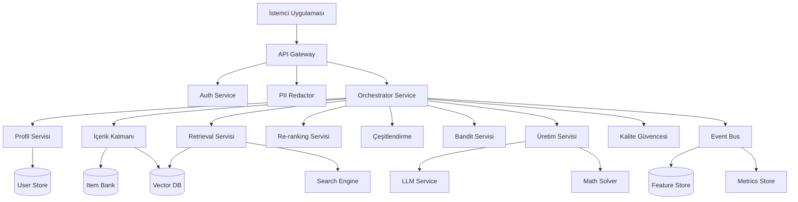

# Design Document

## Overview

Adaptif Soru Öneri Sistemi, öğrencilerin matematik ve İngilizce alanlarında kişiselleştirilmiş öğrenme deneyimi yaşamasını sağlayan FastAPI tabanlı bir backend sistemidir. Sistem, Item Response Theory (IRT), Bandit algoritmaları ve hibrit arama teknolojilerini kullanarak öğrencinin seviyesine uygun sorular önerir ve gerektiğinde yeni sorular üretir.

## Architecture

### High-Level Architecture



### Service Architecture

Sistem mikroservis mimarisi kullanarak aşağıdaki ana bileşenlerden oluşur:

1. **API Gateway**: Rate limiting, CORS, compression
2. **Auth Service**: JWT tabanlı kimlik doğrulama ve RBAC
3. **Orchestrator Service**: Ana iş akışı koordinasyonu
4. **Profile Service**: Öğrenci modelleme (IRT/BKT/DKT)
5. **Retrieval Service**: Hibrit arama (BM25 + Dense)
6. **Re-ranking Service**: Cross-encoder tabanlı yeniden sıralama
7. **Bandit Service**: LinUCB/LinTS adaptif seçim
8. **Generation Service**: Matematik ve İngilizce soru üretimi
9. **Quality Assurance Service**: Soru doğrulama ve kalite kontrol

## Components and Interfaces

### 1. FastAPI Application Structure

```
app/
├── core/                 # Uygulama ayarları ve middleware
│   ├── config.py        # Pydantic Settings
│   ├── security.py      # JWT, RBAC, PII redaction
│   └── middleware.py    # Rate limiting, CORS, logging
├── api/                 # API router'ları
│   ├── v1/
│   │   ├── auth.py      # Kimlik doğrulama endpoints
│   │   ├── recommend.py # Soru önerisi endpoints
│   │   ├── generate.py  # Soru üretimi endpoints
│   │   ├── profile.py   # Öğrenci profili endpoints
│   │   └── admin.py     # Yönetim endpoints
├── models/              # Pydantic modelleri
│   ├── user.py         # User, Profile modelleri
│   ├── item.py         # Math/English item modelleri
│   ├── request.py      # API request modelleri
│   └── response.py     # API response modelleri
├── services/           # İş mantığı servisleri
│   ├── profile_service.py    # IRT/BKT hesaplamaları
│   ├── retrieval_service.py  # Hibrit arama
│   ├── ranking_service.py    # Re-ranking
│   ├── bandit_service.py     # Bandit algoritmaları
│   └── generation_service.py # Soru üretimi
├── db/                 # Veritabanı katmanı
│   ├── models.py       # SQLModel tanımları
│   ├── repositories/   # Repository pattern
│   └── migrations/     # Alembic migrations
└── utils/              # Yardımcı fonksiyonlar
    ├── math_solver.py  # Sympy tabanlı çözücü
    ├── llm_client.py   # LLM API istemcisi
    └── cache.py        # Redis cache wrapper
```

### 2. Authentication & Authorization

**JWT Token Structure:**
```json
{
  "sub": "user_id",
  "role": "student|teacher|admin|service",
  "tenant_id": "tenant_123",
  "exp": 1693478400,
  "permissions": ["read:profile", "write:attempt"]
}
```

**RBAC Matrix:**
- **Student**: Kendi profili, soru çözme, feedback
- **Teacher**: Sınıf öğrencileri, soru onaylama, raporlar
- **Admin**: Tüm veriler, sistem metrikleri, kullanıcı yönetimi
- **Service**: API-to-API iletişim, batch işlemler

### 3. Profile Service (IRT/BKT Implementation)

**IRT 2PL Model:**
```python
# Öğrenci yetenek tahmini
θ_new = θ_old + α * (response - P(θ_old, a, b))

# Soru zorluk parametreleri
P(θ, a, b) = 1 / (1 + exp(-a * (θ - b)))
```

**Error Profile Structure:**
```json
{
  "math": {
    "sign_error": 0.32,
    "ratio_misuse": 0.18,
    "order_of_operations": 0.25
  },
  "en": {
    "prepositions": 0.45,
    "articles": 0.28,
    "subject_verb_agreement": 0.33
  }
}
```

### 4. Retrieval Service Architecture

**Hybrid Search Pipeline:**
1. **Dense Retrieval**: Sentence transformers ile embedding
2. **Sparse Retrieval**: BM25 ile keyword matching
3. **Fusion**: RRF (Reciprocal Rank Fusion) ile birleştirme
4. **Metadata Filtering**: Dil, seviye, beceri filtreleri

**Vector Database Schema:**
```json
{
  "item_id": "m_12345",
  "embedding": [0.1, 0.2, ...],
  "metadata": {
    "type": "math|english",
    "skills": ["linear_equation", "algebra"],
    "difficulty_b": 0.2,
    "lang": "tr|en",
    "cefr_level": "B1"
  }
}
```

### 5. Bandit Service Design

**LinUCB Algorithm:**
```python
# Context vector: [θ_math, θ_en, skill_onehot, device, recency]
context = build_context_vector(user, target_skills)

# Upper confidence bound hesaplama
for arm in arms:
    theta = A_inv @ b
    ucb = theta.T @ context + alpha * sqrt(context.T @ A_inv @ context)
    
# En yüksek UCB'li arm seçimi
chosen_arm = argmax(ucb_scores)
```

**Constraint Handling:**
- Minimum başarı oranı: %60
- Konu coverage: %80
- Exploration ratio: %20-30

### 6. Generation Service Architecture

**Math Question Generation:**
```python
# Şablon tabanlı üretim
template = {
    "type": "linear_equation",
    "pattern": "{a}x + {b} = {c}",
    "constraints": {
        "a": {"min": 1, "max": 9, "exclude": [0]},
        "b": {"min": -10, "max": 10},
        "c": {"min": -10, "max": 10}
    }
}

# Programatik doğrulama
solution = sympy.solve(equation)
assert len(solution) == 1  # Tek çözüm garantisi
```

**English Cloze Generation:**
```python
# Hata türü tabanlı boşluk seçimi
error_patterns = {
    "prepositions": ["at", "in", "on", "to"],
    "articles": ["a", "an", "the", ""],
    "collocations": ["make", "do", "take", "have"]
}

# Grammar checker ile doğrulama
is_valid = grammar_checker.check(passage_with_answer)
assert is_valid and single_answer_guaranteed
```

## Data Models

### User Model
```python
class User(SQLModel, table=True):
    id: str = Field(primary_key=True)
    tenant_id: str
    grade: Optional[str]
    lang: str = "tr"
    consent_flag: str = "none"
    theta_math: Optional[float] = 0.0
    theta_en: Optional[float] = 0.0
    error_profile_math: Optional[dict] = {}
    error_profile_en: Optional[dict] = {}
    created_at: datetime
    updated_at: datetime
```

### Math Item Model
```python
class MathItem(SQLModel, table=True):
    id: str = Field(primary_key=True)
    tenant_id: str
    stem: str
    params: Optional[dict]
    solution: Optional[str]
    answer_key: str
    skills: List[str]
    bloom_level: Optional[str]
    difficulty_a: float = 1.0
    difficulty_b: float = 0.0
    lang: str
    status: str = "active"
    generator: Optional[str]
    created_at: datetime
```

### English Item Model
```python
class EnglishItem(SQLModel, table=True):
    id: str = Field(primary_key=True)
    tenant_id: str
    passage: str
    blanks: List[dict]  # [{span, answer, distractors, skill_tag}]
    level_cefr: str
    topic: Optional[str]
    lang: str = "en"
    status: str = "active"
    generator: Optional[str]
    created_at: datetime
```

### Attempt Model
```python
class Attempt(SQLModel, table=True):
    id: str = Field(primary_key=True)
    user_id: str
    item_id: str
    answer: str
    correct: bool
    time_ms: Optional[int]
    hints_used: int = 0
    context: Optional[dict]  # device, session_id
    created_at: datetime
```

## Error Handling

### Error Response Schema
```python
class ErrorResponse(BaseModel):
    code: str
    message: str
    details: Optional[dict] = None
    request_id: str
```

### Error Codes
- `AUTH_INVALID`: Kimlik doğrulama hatası
- `RBAC_DENIED`: Yetki hatası
- `CONSTRAINT_UNSATISFIED`: Bandit kısıtları sağlanamadı
- `MULTIPLE_GOLDS`: Matematik sorusunda çoklu çözüm
- `AMBIGUOUS_CLOZE`: İngilizce sorusunda belirsizlik
- `SCHEMA_INVALID`: Veri doğrulama hatası

### Circuit Breaker Pattern
```python
# LLM servisi için circuit breaker
@circuit_breaker(failure_threshold=5, timeout=60)
async def call_llm_service(prompt: str) -> str:
    # LLM API çağrısı
    pass
```

## Testing Strategy

### 1. Unit Tests
- **Services**: Profile, Retrieval, Bandit, Generation servislerinin iş mantığı
- **Models**: Pydantic model validasyonları
- **Utils**: Math solver, cache, LLM client fonksiyonları

### 2. Integration Tests
- **API Endpoints**: Request/response şemaları
- **Database**: Repository pattern testleri
- **External Services**: LLM, vector DB mock testleri

### 3. Performance Tests
- **Load Testing**: Locust ile endpoint yük testleri
- **Latency**: p95 < 700ms hedefi için benchmark
- **Cache**: Redis cache hit rate testleri

### 4. Quality Assurance Tests
- **Math Generation**: Programatik çözücü doğrulama testleri
- **English Generation**: Grammar checker ve ambiguity testleri
- **Bandit**: Offline evaluation (IPS/DR) testleri

### 5. Security Tests
- **Authentication**: JWT token validation
- **Authorization**: RBAC kuralları
- **PII Protection**: Veri maskeleme testleri
- **Input Validation**: SQL injection, XSS koruması

## Performance Considerations

### Caching Strategy
- **Retrieval Cache**: 24h TTL, Redis
- **Semantic Cache**: Prompt similarity > 0.92
- **Profile Cache**: 1h TTL, frequent updates

### Database Optimization
- **Indexing**: user_id, item_id, skills, timestamp
- **Partitioning**: Tarih bazlı partisyonlama
- **Connection Pooling**: AsyncPG pool

### Monitoring & Observability
- **Metrics**: Prometheus + Grafana
- **Tracing**: OpenTelemetry
- **Logging**: Structured JSON logs
- **Alerting**: SLO breach notifications